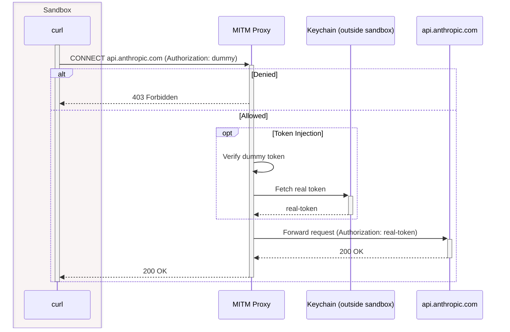

# Sandbox

## Overview

**nix-jail** uses kernel-enforced sandboxing to limit agent access and prevent infostealer and script kiddie attacks.

Platform-specific executors provide defense-in-depth isolation:
- **SandboxExecutor** (macOS) - Apple sandbox-exec with SBPL profiles
- **SystemdExecutor** (Linux) - systemd transient units with comprehensive hardening
- **DockerExecutor** (cross-platform) - Container isolation with capability dropping

See [TESTING.md](TESTING.md) for usage examples and testing workflows.

## Architecture

### Job Directory Structure

Each job gets an isolated directory structure with clear security boundaries:

```
/var/lib/nix-jail/jobs/{job_id}/     # job_dir.base (OUTSIDE sandbox)
├── proxy-config.json                 # Proxy config with credentials (created when proxy is used)
├── bin/                              # Security wrapper binaries (only with keychain credentials)
├── workspace/                        # job_dir.workspace (bind-mounted to /workspace in sandbox)
│   └── src/                          # Git repo (only when using --git-url)
└── root/                             # job_dir.root (INSIDE sandbox, becomes /)
    ├── etc/ssl/certs/
    │   └── ca-certificates.crt       # Proxy CA cert (created when proxy is used)
    ├── home/{user}/                  # Sandbox home directory ($HOME)
    │   ├── .config/                  # XDG_CONFIG_HOME
    │   ├── .cache/                   # XDG_CACHE_HOME
    │   └── .local/
    │       ├── share/                # XDG_DATA_HOME
    │       └── state/                # XDG_STATE_HOME
    └── nix/store/                    # Nix closure (cached strategy only, not bind-mount)
```

**Notes on directory structure:**
- `workspace/src/` is only created when using `--git-url` (git clone creates it)
- For empty workspaces or scripts, `workspace/` is used directly without the `src/` subdirectory
- The workspace is bind-mounted directly to `/workspace` in the chroot (no symlink)
- `bin/` directory is only created when using keychain-based credentials (setup_claude_config)
- `home/{user}/` is `home/nix-jail/` on Linux (systemd), `home/sandbox/` on macOS (sandbox-exec)

**Environment variables:**
- **Chroot mode** (systemd, docker): `$HOME=/home/{user}` (chroot-relative path)
- **Non-chroot mode** (macOS sandbox-exec): `$HOME={job_dir.root}/home/{user}` (absolute host path)

Both modes use the same physical location under `root/home/`, ensuring consistent behavior and a single source of truth for home directory contents.

**Security boundaries:**
- **Outside sandbox** (`job_dir.base`): Contains sensitive configuration that sandboxed code cannot access (proxy credentials, network policy)
- **Inside sandbox** (`job_dir.workspace`, `job_dir.root`): Accessible from within the sandbox. The root becomes `/` via chroot, workspace becomes `/workspace`

This separation ensures sandboxed code cannot access proxy credentials or modify network policies.

### Execution Flow

nix-jail executes jobs through a seven-stage pipeline:

1. **Job directory setup** - Create base/workspace/root structure with proper ownership
2. **Workspace setup** - Clone git repository into workspace (if specified)
3. **Proxy startup** - Spawn per-job MITM proxy; config in base (outside sandbox), CA cert in root (inside sandbox)
4. **Nix resolution** - Compute minimal package closure for programs, or detect flake.nix for flake shell
5. **Root preparation** - Prepare chroot root directory via btrfs snapshot (instant) or copy from cache
6. **Sandboxed execution** - Execute the job within the sandbox environment for the platform
7. **Cleanup** - Kill proxy, delete job directory

Each stage is designed for security isolation and resource cleanup. The workspace is isolated from the host system. The proxy controls all network access. The Nix resolution ensures only required packages are accessible (with flake support for complex environments). Root preparation uses btrfs snapshots when available for near-instant job startup. The executor enforces platform-specific sandboxing. Cleanup ensures no resource leaks.

### Network Isolation

The sandbox isolates jobs from the network. Each job gets its own proxy, and the sandbox sets the `HTTP_PROXY` environment variable so that programs within the sandbox will use the proxy. The proxy controls which hosts jobs can connect to.

The proxy uses a per-job CA to intercept HTTPS traffic from the sandbox environment, enforcing policy on both the host _and_ the path, even on HTTPS.

The proxy injects credentials to outgoing requests - this allows the sandbox to use credentials that code within the sandbox [cannot access](https://www.youtube.com/watch?v=otCpCn0l4Wo&t=15s).

#### Network Topology

**macOS:** Proxy listens on localhost, sandbox has localhost-only network access enforced by SBPL profile.

**Linux (systemd):** Stronger kernel-level isolation using network namespaces with veth pairs:
- Proxy binds to `0.0.0.0:3128` (before veth exists), jobs connect via their veth interface
- Each job gets a unique /30 subnet from 10.0.0.0/16 (e.g., first job: proxy=10.0.0.1, sandbox=10.0.0.2)
- Supports ~16,384 concurrent jobs with isolated subnets preventing cross-job communication
- Sandbox can ONLY communicate with proxy - kernel enforced, no escape possible
- Uses `rtnetlink` for production-grade network namespace configuration

**Docker:** Custom bridge network "nix-jail" isolates containers:
- Proxy binds to `0.0.0.0:3128`, accessible at bridge gateway (172.17.0.1)
- Containers connect to nix-jail network, route all traffic through proxy
- Network isolation via Docker's built-in network namespaces

This architecture ensures sandboxed code cannot bypass the proxy even with privilege escalation.

#### Token Injection



The proxy enforces rule-based network policies with server-controlled credential binding. The server defines available credentials and their allowed hosts, while clients specify per-job policies that can be more restrictive. See [Appendix B](#b-network-policy-specification) for detailed policy configuration.

### Key Abstractions

nix-jail uses trait-based abstractions to support different deployment modes (server vs CLI) and storage backends (btrfs vs reflink vs standard). This enables the same orchestration code to work across platforms.

**WorkspaceStorage** (`src/cache/btrfs.rs`) - Filesystem operations with copy-on-write semantics:
- `BtrfsStorage`: btrfs subvolumes and instant snapshots (Linux)
- `ReflinkStorage`: CoW reflinks (XFS, APFS, btrfs without subvolume permissions)
- `StandardStorage`: fallback `cp -a`

Auto-detected at startup via `detect_storage()`. Used by both JobRoot and JobWorkspace.

**JobRoot** (`src/root.rs`) - Prepares the sandbox root directory (`/nix/store` closure):
- `CachedJobRoot`: LRU-cached closures with btrfs snapshots for O(1) job startup
- `BindMountJobRoot`: zero-copy via `BindReadOnlyPaths` (systemd only)
- `DockerVolumeJobRoot`: named Docker volumes for cross-architecture support

Selected via `store_strategy` in server config. Returns `StoreSetup` enum that tells executors how to mount the store.

**JobWorkspace** (`src/job_workspace.rs`) - Prepares the job workspace (git clone, subpath navigation):
- `StandardJobWorkspace`: fresh clone each time
- `CachedJobWorkspace`: caches clones by (repo, commit_sha), snapshots to workspace

**LogSink** (`src/log_sink.rs`) - Decouples log handling from job orchestration:
- `StorageLogSink`: persists to SQLite, broadcasts to gRPC clients (server mode)
- `StdioLogSink`: prints to stdout/stderr (CLI mode)

### Platform Executors

#### macOS (SandboxExecutor)

The **SandboxExecutor** uses Apple's sandbox-exec framework with Sandbox Profile Language (SBPL). The sandbox profile is deny-by-default with explicit allow rules for the Nix closure, workspace, and localhost networking.

```bash
sandbox-exec -f /tmp/nix-jail-{job_id}/sandbox.sb bash -c "$script"
```

The sandbox cuts off as much of the system as possible - closure-scoped Nix store access (not entire /nix/store), localhost-only networking to force proxy usage, and mocked `security` CLI to prevent keychain access from within the sandbox.

Profile generation is in `src/executor/sandbox_policy.rs`. To debug denials, use the `/sandbox-exec` command (see `.claude/commands/sandbox-exec.md`).

References: [App Sandbox Design Guide](https://developer.apple.com/library/archive/documentation/Security/Conceptual/AppSandboxDesignGuide/), [SBPL spec](https://reverse.put.as/wp-content/uploads/2011/09/Apple-Sandbox-Guide-v1.0.pdf), `man sandbox-exec`

#### Linux (SystemdExecutor)

The **SystemdExecutor** uses systemd transient units with comprehensive hardening. Jobs execute in isolated environments with minimal access to the host system.

```bash
systemd-run --unit=nix-jail-{job_id} --scope --user \
  --property=RootDirectory=/tmp/nix-jail-{job_id}/root \
  [... hardening properties ...] \
  /bin/bash /workspace/script.sh
```

**Defense-in-Depth:** Hardening properties provide five layers of defense - filesystem isolation, user/privilege controls, syscall filtering, memory/execution controls, and network isolation. See [Appendix C](#c-linux-hardening-reference) for the complete property reference.

**Hardening Profiles:**

The default security posture includes all hardening properties. However, hardening profiles allow explicit, documented weakening for specific workload requirements:

- **Default Profile**: Maximum security for general workloads. Includes `MemoryDenyWriteExecute=true` which prevents W^X violations and **blocks JIT compilation** - this is intentional for maximum security.

- **JIT Runtime Profile**: Removes `MemoryDenyWriteExecute=true` to enable legitimate JIT compilation required by runtimes like Node.js V8, Python PyPy, Java/JVM, and WebAssembly engines. All other hardening properties remain active. Use ONLY when running JIT-based runtimes (Node.js, Python with JIT, Java, etc.). Users must explicitly request via `--hardening-profile jit-runtime`.

**Store Strategy:**

nix-jail supports three strategies for making the Nix store available inside the sandbox, configurable via `store_strategy` in server config:

- **cached** (default): Caches and snapshots the closure into the chroot root directory. Uses btrfs snapshots for O(1) creation when available, with LRU cache for repeated executions. Allows inspecting the full chroot after job completion.
- **bind-mount**: Bind-mounts each store path from host `/nix/store` directly into the chroot using `BindReadOnlyPaths`. Instant startup, no disk space overhead, but chroot is empty after job completion.
- **docker-volume**: Caches closures in named Docker volumes. Essential for macOS where host `/nix/store` contains darwin binaries but containers need Linux binaries. On cache miss, runs `nix-build` inside a container to populate the volume with correct-architecture packages. See Docker executor section for details.

**Isolation Mechanisms:**

- **Filesystem:** RootDirectory property creates chroot-like isolation. Nix closure copied into root (default) or via bind-mounts. Workspace bind-mounted to `/workspace`.
- **Network:** Dedicated network namespace per job with veth pair connecting sandbox to proxy. Job cannot access host network or other jobs.
- **Execution:** Jobs run as dynamically-created users with no capabilities, memory-safe execution enforced, and comprehensive syscall filtering.

#### Docker (DockerExecutor)

The **DockerExecutor** provides cross-platform container isolation using Docker. Available on any system with Docker (Linux, macOS with Docker Desktop, WSL2).

```bash
docker run --rm \
  --cap-drop=ALL --security-opt=no-new-privileges \
  --read-only --tmpfs /tmp:noexec,nosuid,size=64m \
  --cpus=2 --memory=2g --pids-limit=100 \
  --network=nix-jail \
  -v /workspace:/workspace \
  nixos/nix:latest /bin/bash /workspace/script.sh
```

**Security Hardening:**

- `--cap-drop=ALL`: Remove all Linux capabilities
- `--security-opt=no-new-privileges`: Prevent privilege escalation
- `--read-only`: Immutable root filesystem
- `--tmpfs=/tmp:noexec,nosuid,size=64m`: Private temp with execute/setuid disabled
- Resource limits: 4GB RAM, 100 PIDs, 1024 file descriptors (no CPU limit)

**Network:** Custom Docker bridge network "nix-jail" routes all traffic through the proxy at 172.17.0.1:3128.

**Store Strategy for Docker:**

On macOS, the host `/nix/store` contains darwin binaries which cannot run in Linux containers. The `docker-volume` store strategy solves this:

1. **Cache key**: Compute hash from requested packages (same as btrfs cache)
2. **Cache miss**: Create named Docker volume, run `nix-build` inside a container to populate it with Linux binaries from cache.nixos.org
3. **Cache hit**: Volume already exists, mount directly (instant)
4. **Job execution**: Mount volume at `/nix:ro`, set PATH dynamically from `/nix/store/*/bin`

```bash
# Cache miss: populate volume with Linux packages
docker run --rm -v nix-jail-{hash}:/nix nixos/nix:latest \
  nix-build -E 'with import <nixpkgs> {}; [cowsay bash]' --no-out-link

# Job execution: use alpine with pre-populated volume
docker run --rm -v nix-jail-{hash}:/nix:ro alpine:latest \
  sh -c 'export PATH="$(find /nix/store -maxdepth 2 -type d -name bin | tr "\n" ":")$PATH" && cowsay hello'
```

This enables the same caching semantics as btrfs snapshots but works across the macOS/Linux boundary.

**Isolation Mechanisms:**

- **Filesystem:** Container has read-only root with workspace bind-mounted. Nix store from host bind-mounts, volume mounts, or container image.
- **Network:** Custom bridge network isolates containers. Proxy at bridge gateway controls all egress.
- **Execution:** Runs as nobody:nogroup (65534:65534) with no capabilities.

## Features

### Package Management

nix-jail resolves Nix packages using `nix-instantiate --eval` with in-memory caching for fast repeated execution. The system supports multiple nixpkgs versions (release branches and git commits) with automatic package closure computation.

**Multi-version Nixpkgs Support:**
```bash
# Use default (nixos-25.11, pinned stable)
nix-jail exec -p bash -s script.sh

# Use a specific release
nix-jail exec -p bash -s script.sh --nixpkgs-version nixos-24.05

# Use unstable
nix-jail exec -p bash -s script.sh --nixpkgs-version nixos-unstable

# Use specific commit SHA
nix-jail exec -p bash -s script.sh --nixpkgs-version ae2fc9e0e42cf268be9f068c1bfdc11c71
```

**Caching:** Global LRU cache (1000 entries, 24-hour TTL) provides ~2.4x speedup on repeated executions (~330ms first run, ~0ms on cache hits).

**Security Validation:** Package names validated (no path traversal), version strings validated (branch names or commit SHAs), Nix expressions built with `fetchTarball`/`fetchGit` (no arbitrary code execution).

**Automatic Interpreter Detection:** The CLI auto-detects interpreters from script shebangs, reducing manual `-p` specification.

**Flake Support:** When the workspace contains a `flake.nix`, nix-jail automatically uses `nix develop` shell instead of explicit package resolution. This enables complex development environments with full flake ecosystem support.

### Git Integration

nix-jail supports cloning git repositories as job workspaces, with shallow clones for performance and authentication support.

**Git Ref Support:**
```bash
# Clone from branch
nix-jail exec --git-url https://github.com/user/repo --git-ref main -s script.sh

# Clone from tag
nix-jail exec --git-url https://github.com/user/repo --git-ref v1.0.0 -s script.sh

# Clone from commit SHA
nix-jail exec --git-url https://github.com/user/repo --git-ref abc123def -s script.sh
```

**Features:**
- **Shallow clones**: depth=1 for branches/tags to minimize clone time
- **Authentication**: GitHub token support via environment variables
- **git2 library**: Production-grade git implementation via libgit2 bindings
- **Security**: Repository URLs validated, credentials passed securely

**PR Creation:** The protobuf includes a `push` field for detecting commits created during job execution and pushing them for PR creation (in progress).

## Security Model

### Threat Model

**What we defend against:**
- Supply chain attacks from compromised dependencies (NPM/pip/gem packages)
- Script kiddies and infostealer malware
- Credential theft from sandboxed code
- Network exfiltration attempts
- Filesystem escape attempts
- Privilege escalation within the sandbox

**What we don't defend against:**
- Nation-state attackers with kernel 0-day exploits
- Hardware-level attacks
- Side-channel attacks (Spectre/Meltdown variants)
- Physical access to the machine

nix-jail is designed for trusted workloads running untrusted code (e.g., CI/CD agents, development sandboxes), not multi-tenant production environments.

### Defense Layers

nix-jail provides five overlapping defense layers:

1. **Network Proxy** - MITM proxy with token injection, credential isolation, policy enforcement, and HTTPS path inspection
2. **Filesystem Isolation** - Platform-specific mechanisms restrict access to only the minimal Nix package closure and workspace
3. **Network Namespaces** (Linux) - Kernel-enforced network isolation, proxy-only communication, no host network access
4. **Syscall Filtering** (Linux) - Comprehensive allowlist of safe syscalls, blocks dangerous operations
5. **Privilege Control** - Dynamic users, no capabilities, prevents privilege escalation

Each layer independently blocks common attack vectors. Even if one layer is bypassed, the others remain effective.

### Security Trade-offs

- Blocks 99% of supply chain attacks through defense-in-depth
- Suitable for trusted workloads running untrusted code
- Not suitable for multi-tenant production without additional isolation

**Sandboxing Technology Comparison**

nix-jail supports three executor backends. The table compares these to external alternatives:

| Feature | systemd | Docker | sandbox-exec | bubblewrap | nsjail | Firecracker |
|---------|---------|--------|--------------|------------|--------|-------------|
| **Platform** | Linux | Cross-platform | macOS | Linux | Linux | Linux |
| **Nix Closures** | RootDirectory | Volume mounts | Closure allow rules | 100+ bind flags | 100+ -R flags | VM filesystem |
| **Resource Limits** | Built-in | Built-in | ulimit | Manual cgroups | Built-in | VM resources |
| **Seccomp** | @system-service | Default profile | N/A | Manual BPF | Kafel DSL | VM isolation |
| **Network** | Namespace + veth | Bridge network | SBPL rules | Manual setup | Manual/macvlan | VM networking |
| **Privilege** | Root required | Root (daemon) | User | Unprivileged | Root required | Root required |

**nix-jail backends (built-in):** systemd (Linux default), Docker (cross-platform), sandbox-exec (macOS default).

**Why systemd on Linux:** Nix package closures typically contain 10-100+ packages. systemd's RootDirectory property handles this with a single chroot, comprehensive hardening, and built-in resource limits. Present on 99% of modern Linux distributions.

**Why Docker:** Cross-platform support (Linux, macOS with Docker Desktop, WSL2). Useful for non-systemd Linux (Alpine, Gentoo) or unified tooling across platforms.

**When external alternatives are better:** bubblewrap for unprivileged sandboxing. nsjail for fine-grained seccomp (browser/JIT sandboxing). Firecracker for VM-level isolation in multi-tenant production.

**Prior art:** [hermit](https://github.com/thepwagner/hermit) - Firecracker + MITM proxy for SLSA builds (Go)

## Appendices

### A. Implementation Map

Core implementation organized by responsibility:

**Executors:**
- `src/executor/sandbox.rs` - macOS SandboxExecutor
- `src/executor/sandbox_policy.rs` - SBPL profile generation
- `src/executor/systemd.rs` - Linux SystemdExecutor
- `src/executor/docker.rs` - Cross-platform DockerExecutor

**Network:**
- `src/proxy/mod.rs` - MITM proxy server
- `src/proxy/mitm.rs` - HTTPS interception
- `src/proxy/policy.rs` - Policy enforcement and credential injection
- `src/proxy_manager.rs` - Proxy lifecycle management

**Package Resolution:**
- `src/workspace/nix.rs` - Package resolution and closure computation
- `src/workspace/cache.rs` - LRU caching
- `src/workspace/flake.rs` - Flake integration
- `src/workspace/git.rs` - Git clone support
- `src/workspace/pr.rs` - PR creation workflow

**Job Management:**
- `src/orchestration.rs` - Job execution orchestration
- `src/job_dir.rs` - JobDirectory struct (base/workspace/root paths)
- `src/job_workspace.rs` - JobWorkspace trait for workspace setup
- `src/root.rs` - JobRoot trait for root filesystem setup
- `src/log_sink.rs` - LogSink trait for log output
- `src/cache/btrfs.rs` - WorkspaceStorage trait and implementations
- `src/service.rs` - gRPC service implementation
- `src/config.rs` - Server configuration management

### B. Network Policy Specification

The proxy enforces rule-based network policies with server-controlled credential binding. The server defines available credentials and their allowed hosts, while clients specify per-job policies that can be more restrictive.

**Server Configuration (TOML):**
```toml
[server]
addr = "127.0.0.1:50051"
state_dir = "/var/lib/nix-jail"
# Store strategy: "cached" (default), "bind-mount", or "docker-volume"
store_strategy = "cached"
# Executor: "systemd" (Linux default), "sandbox" (macOS default), or "docker"
executor = "systemd"

[[credentials]]
name = "anthropic"
keychain_service = "Claude Code-credentials"
allowed_host_patterns = ["api\\.anthropic\\.com"]
header_format = "Bearer {token}"

[[credentials]]
name = "github"
source_env = "GITHUB_TOKEN"
allowed_host_patterns = ["github\\.com", "api\\.github\\.com"]
header_format = "token {token}"
```

**Client NetworkPolicy (per-job, via protobuf):**
```protobuf
message NetworkPolicy {
  repeated NetworkRule rules = 1;  // Ordered list, first match wins
}

message NetworkRule {
  NetworkPattern pattern = 1;     // HostPattern or IpPattern
  NetworkAction action = 2;       // ALLOW or DENY
  optional string credential = 3; // Credential name (ALLOW rules only)
}

message HostPattern {
  string host = 1;           // Regex: "api\\.anthropic\\.com"
  optional string path = 2;  // Regex: "/v1/.*" (optional)
}

message IpPattern {
  string cidr = 1;  // "10.0.0.0/8", "192.168.0.0/16"
}
```

**Policy Enforcement:**
- **Ordered matching**: First matching rule wins (like firewall rules)
- **DNS resolution**: Hostnames resolved to IPs before connection, matched against IP CIDR patterns
- **Host + path matching**: Regex patterns for both host and path (HTTPS via MITM)
- **Credential injection**: Per-rule credential binding - server validates client cannot request arbitrary keychain services
- **DNS rebinding protection**: IP CIDR patterns prevent DNS rebinding attacks

**Security Properties:**
- Server binds credentials to specific hosts (prevents credential theft)
- Client cannot specify arbitrary keychain services
- DNS resolution + IP matching prevents rebinding attacks
- Default deny enforced
- All blocked requests logged

### C. Linux Hardening Reference

The SystemdExecutor applies hardening properties across seven categories:

| Category | Properties | Purpose |
|----------|-----------|---------|
| **Filesystem Isolation** | PrivateTmp, ProtectSystem=strict, ProtectKernelTunables, ProtectKernelModules, ProtectKernelLogs, ProtectControlGroups, ProtectProc=invisible, ProcSubset=pid, PrivateDevices | Restrict filesystem access to minimal required paths |
| **User & Privilege** | User=nix-jail, Group=nix-jail, NoNewPrivileges, RestrictSUIDSGID, CapabilityBoundingSet=, AmbientCapabilities= | Prevent privilege escalation and capability acquisition |
| **Syscall Filtering** | SystemCallFilter=@system-service, SystemCallErrorNumber=EPERM, SystemCallArchitectures=native, RestrictNamespaces=true | Allowlist safe syscalls, block dangerous operations |
| **Memory/Execution** | MemoryDenyWriteExecute, LockPersonality, RestrictRealtime | Prevent W^X violations and memory exploits |
| **Network Isolation** | RestrictAddressFamilies=AF_UNIX AF_INET AF_INET6 | Isolate network access to proxy-only communication |
| **Resource Limits** | RuntimeMaxSec, MemoryMax=4G, TasksMax=512, LimitNOFILE=1024 | Prevent resource exhaustion attacks |
| **Cleanup/Isolation** | RemoveIPC, KeyringMode=private, UMask=0000, ProtectClock | Clean up resources and isolate kernel interfaces (permissive umask safe due to chroot isolation) |

**Note:** `PrivateNetwork=true` was replaced with `NetworkNamespacePath` to enable network namespace integration with the veth pair topology.

**Hardening Profiles:**

- **Default**: All properties enabled
- **JIT Runtime**: Removes `MemoryDenyWriteExecute` for JIT compilation support (Node.js, PyPy, JVM)

### D. External References

**Project Documentation:**
- [ROADMAP.md](ROADMAP.md) - Future enhancements (Firecracker migration, rate limiting)
- [CLAUDE.md](CLAUDE.md) - Development guidelines and security rules

**Technical References:**
- [App Sandbox Design Guide](https://developer.apple.com/library/archive/documentation/Security/Conceptual/AppSandboxDesignGuide/) - Apple sandbox-exec documentation
- [SBPL Specification](https://reverse.put.as/wp-content/uploads/2011/09/Apple-Sandbox-Guide-v1.0.pdf) - Sandbox Profile Language reference
- `man sandbox-exec` - macOS sandbox-exec manual page
- `man systemd.exec` - systemd execution environment configuration

**Prior Art:**
- [hermit](https://github.com/thepwagner/hermit) - Firecracker + MITM proxy for SLSA builds
