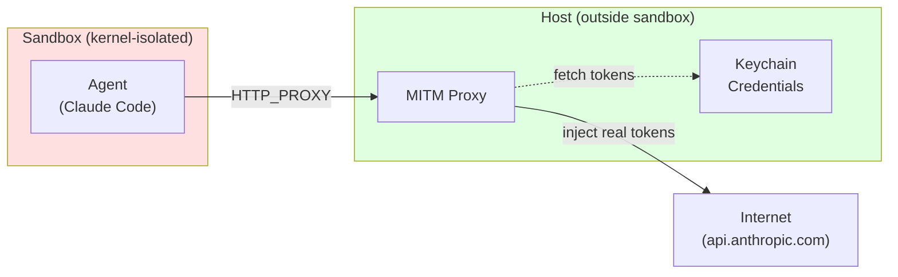
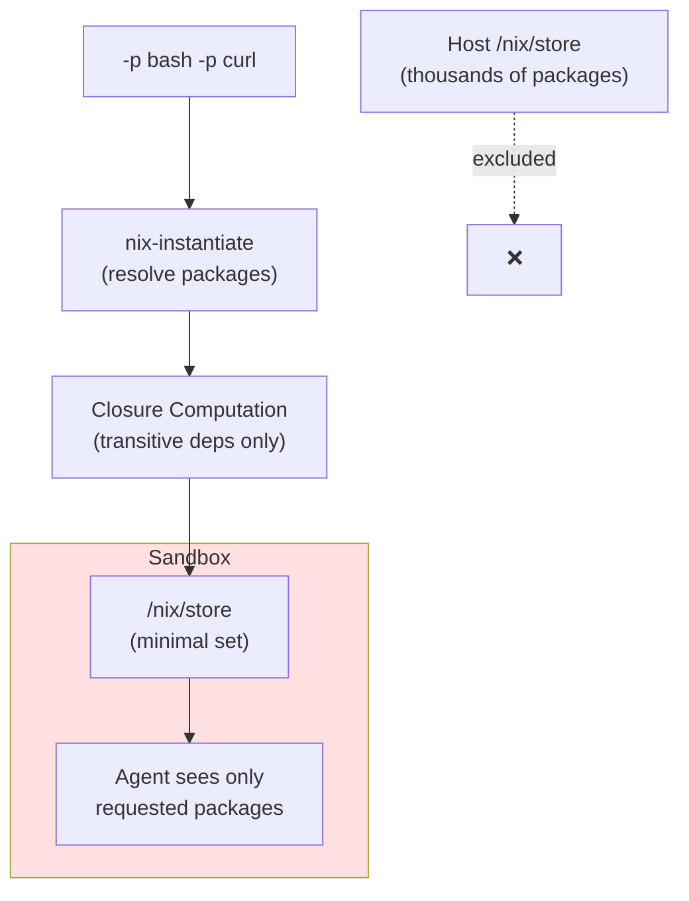
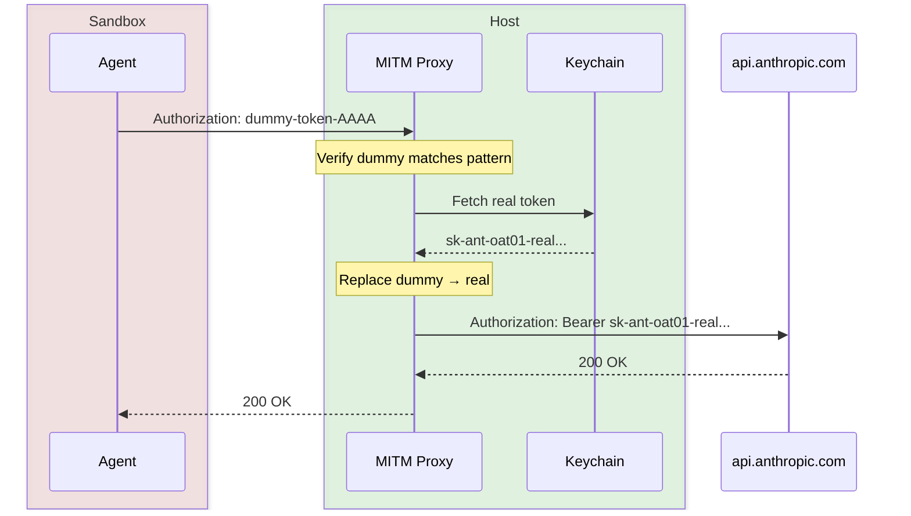

# nix-jail Overview

## Slide 1: Job = Sandbox + Proxy

**Key points:**
- Jobs run in platform sandboxes (macOS sandbox-exec, Linux systemd, Docker)
- Each job gets its own MITM proxy controlling all network
- Sandbox cannot bypass proxy (kernel-enforced)

---

## Slide 2: Nix Expression → Minimal Closure

**Key points:**
- `-p bash -p curl` → only those packages + dependencies
- Flake support: `flake.nix` → `nix develop` shell automatically
- No access to host's full `/nix/store`

---

## Slide 3: Dummy Token Injection

**Key insight:** Real tokens never enter the sandbox.

Compromised code in sandbox only sees `dummy-token-AAAA` - useless outside.
