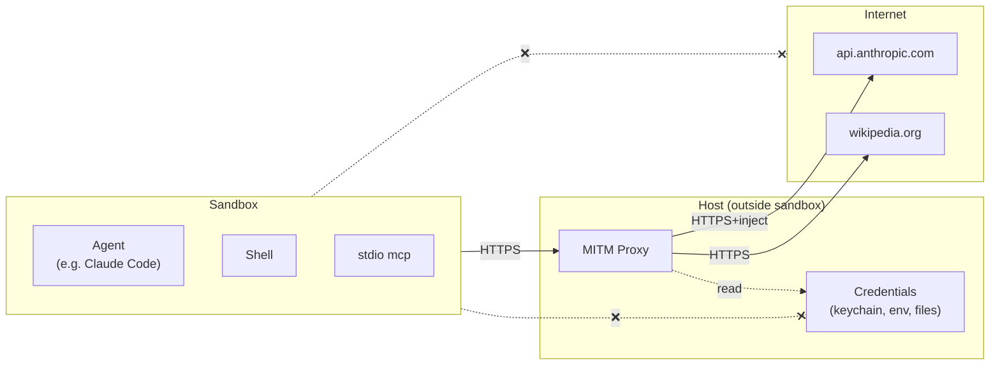
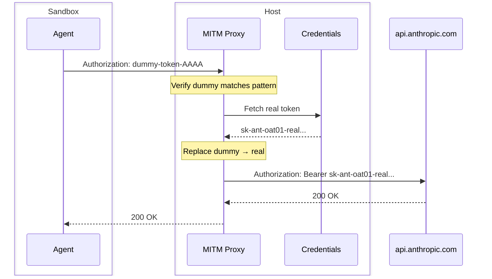

# nix-jail Overview

## Slide 1: Job = Sandbox + Proxy



**Key points:**
- Sandbox has NO direct internet access - must go through proxy
- Sandbox has NO access to credentials (keychain, env vars, files)
- Sandbox backends: sandbox-exec (macOS), systemd (Linux), Docker (both)

---

## Slide 2: Sandbox Contents from Nix Expression

The sandbox environment is derived **at job time** from a Nix expression.

**Option 1: Nixpkgs branch + packages**
```bash
nix-jail run --nixpkgs nixos-24.11 -p cargo -p rustfmt -p clippy -- cargo build
```

**Option 2: Flake with mkShell**
```nix
# shell.nix
pkgs.mkShell {
  buildInputs = with pkgs; [
    cargo
    rustfmt
    clippy
    protobuf
    pkg-config
    openssl.dev
  ];
}
```
```bash
nix-jail run -- cargo build  # uses flake.nix/shell.nix from workspace
```

**Key point:** Only the packages you specify (+ their dependencies) are available in the sandbox.

---

## Slide 3: Dummy Token Injection



**Key insight:** Real tokens never enter the sandbox.

Compromised code in sandbox only sees `dummy-token-AAAA` - useless outside.
